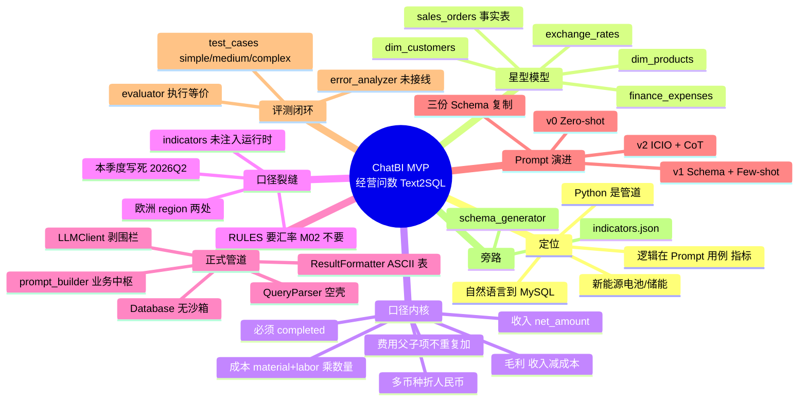
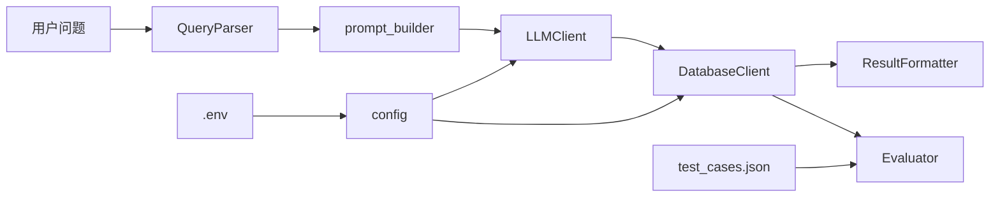
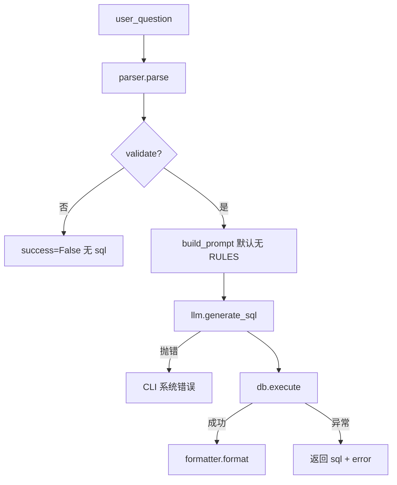
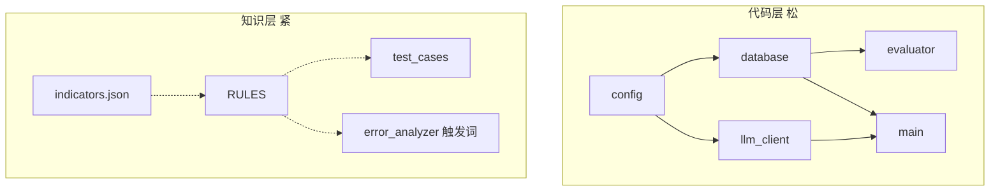
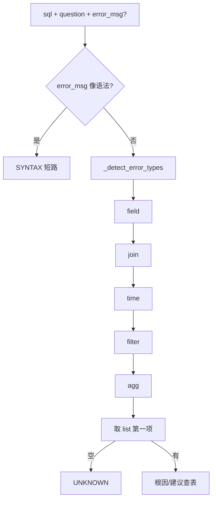

# ChatBI 项目思维导图

交互版（Cursor 聊天旁打开）：`docs/canvases/chatbi-mind-map.canvas.tsx`

在 Markdown 预览里可直接看下面的 Mermaid（VS Code / GitHub 预览）。

## 1. 总览树

## 2. 运行链路

`main.run` 逐步：

## 3. 耦合依赖

改「收入」要对齐：RULES、M02 金标、JOIN 检测、indicators 公式。

## 4. error_analyzer 逻辑

时间检查：对 `sql.lower()` 找大写 `DATE_SUB` → 相对时间题易恒真。
