# 核心模块逻辑思维导图

交互版（Cursor 聊天旁打开）：`docs/canvases/chatbi-module-logic.canvas.tsx`

详细文字拆解见 `docs/02-核心模块逻辑拆解.md`。

## 模块关系

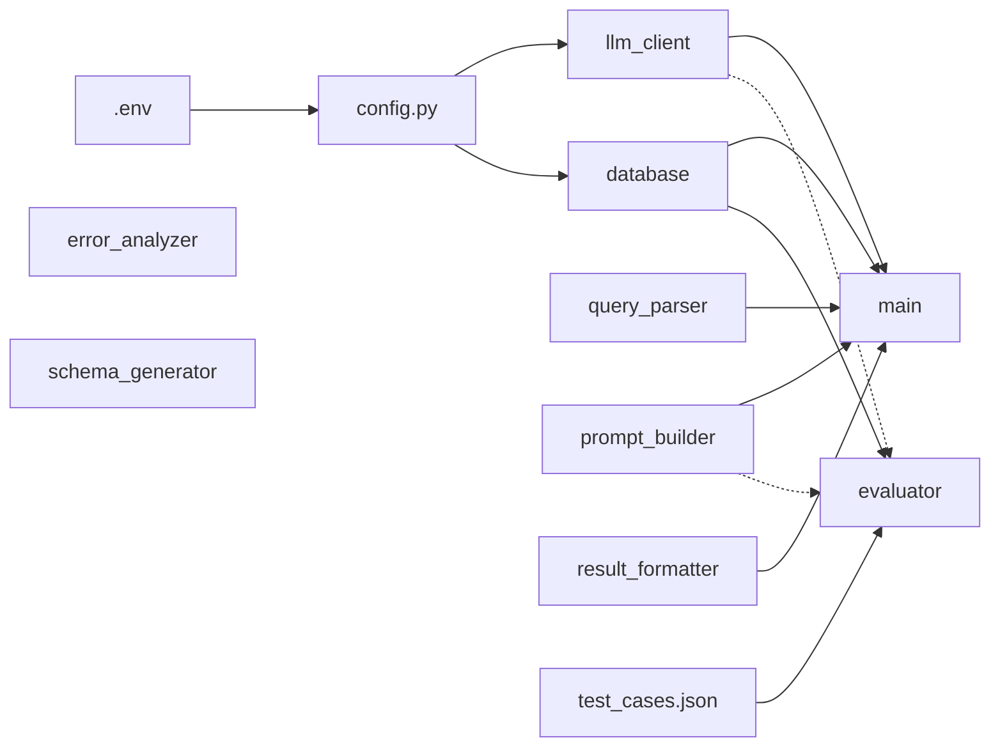

虚线：仅 `evaluator.__main__` 组合，类本身不 import Prompt/LLM。`error_analyzer` / `schema_generator` 无引用。

## 各模块控制流

### config.py

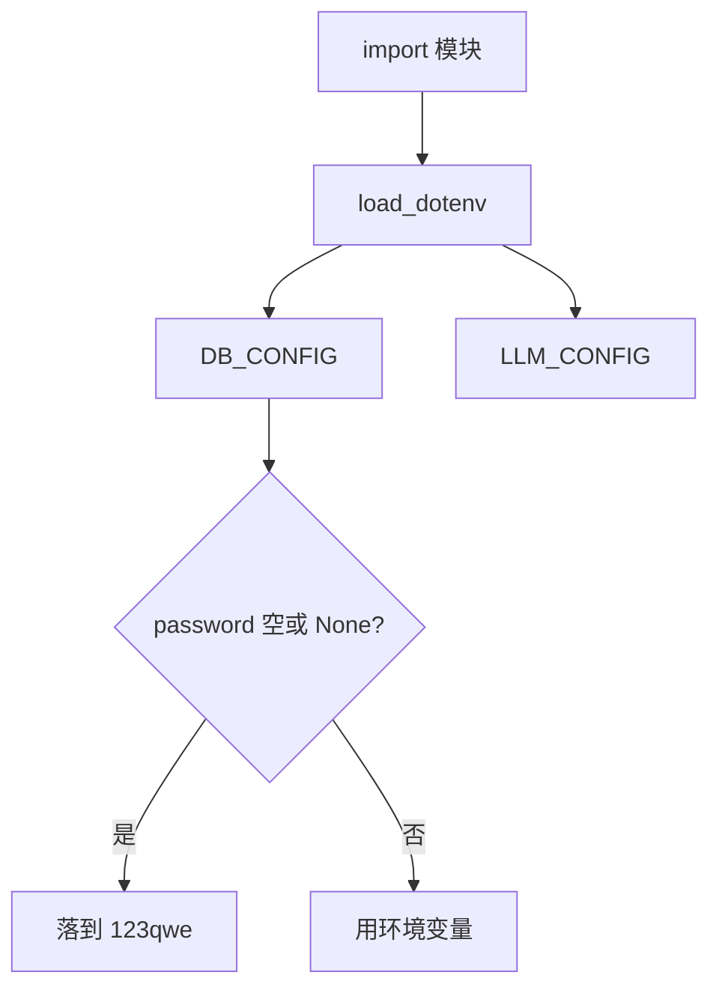

### query_parser.py

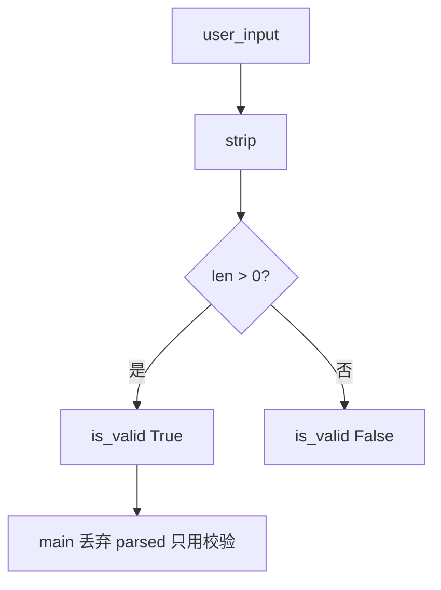

### prompt_builder.py

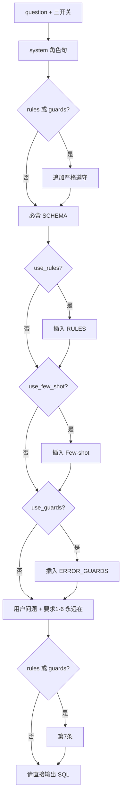

### llm_client.py

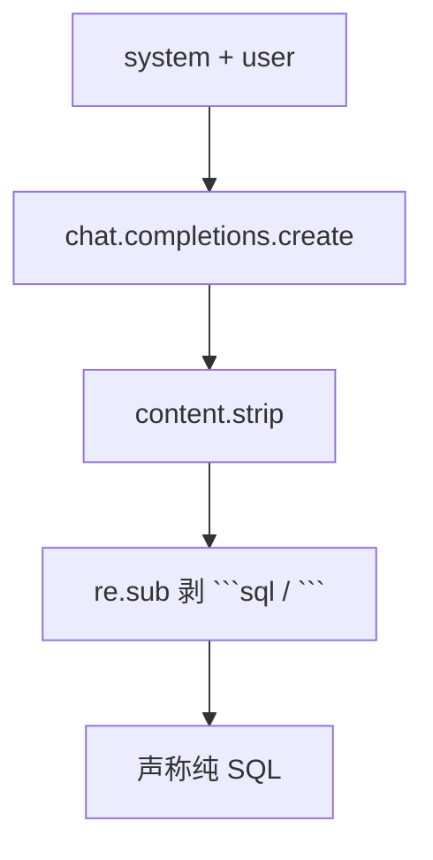

### database.py

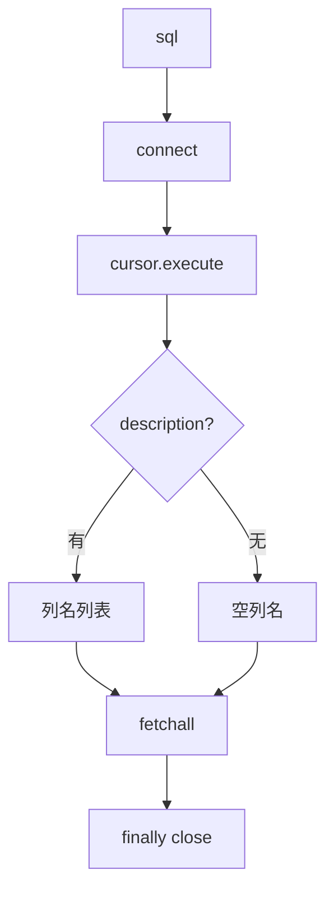

### result_formatter.py

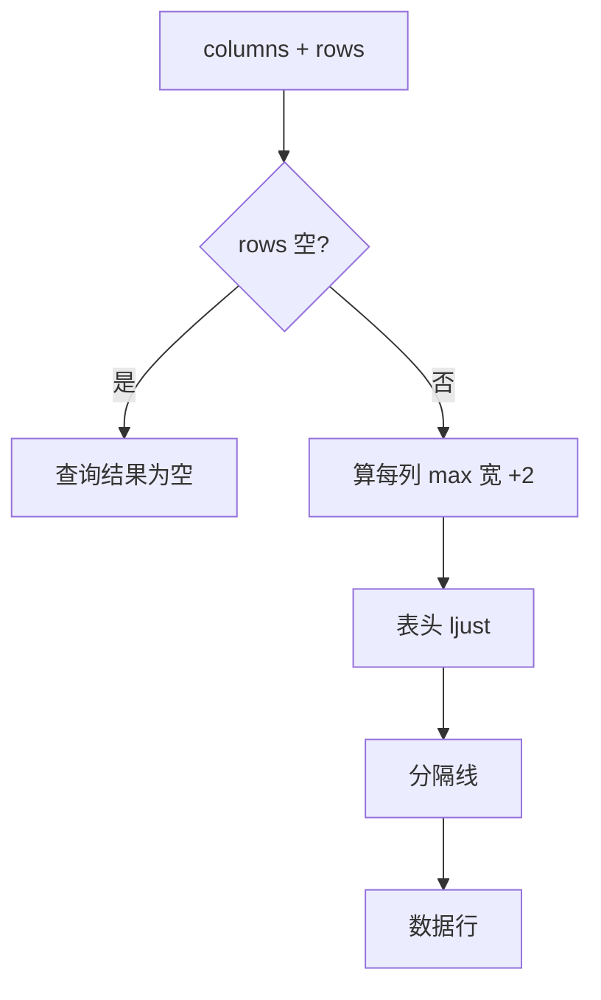

### main.py ChatBISystem.run

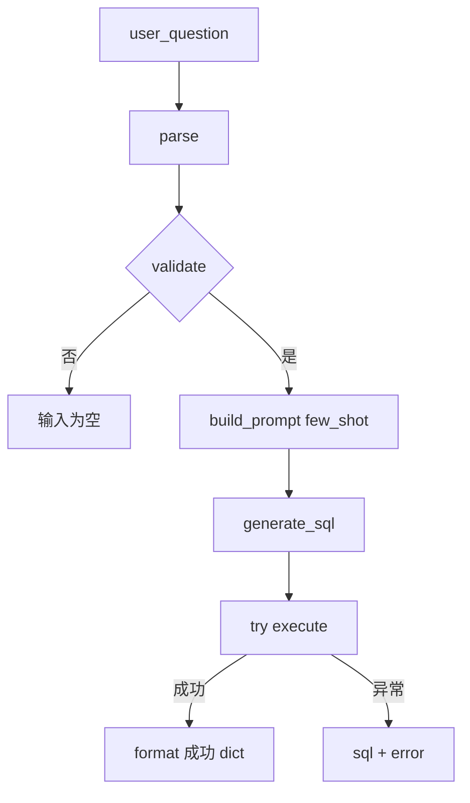

### evaluator.py evaluate_one

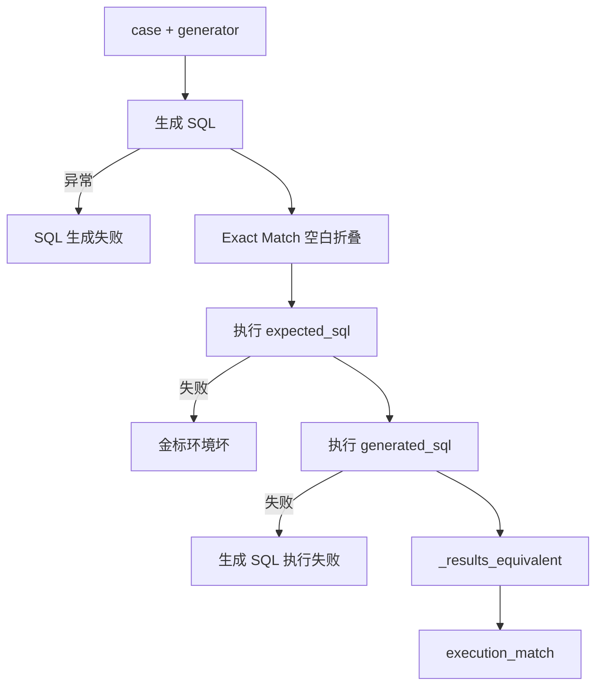

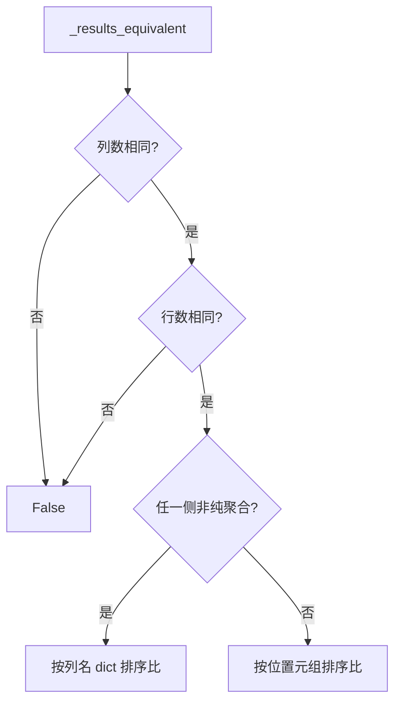

### error_analyzer.py

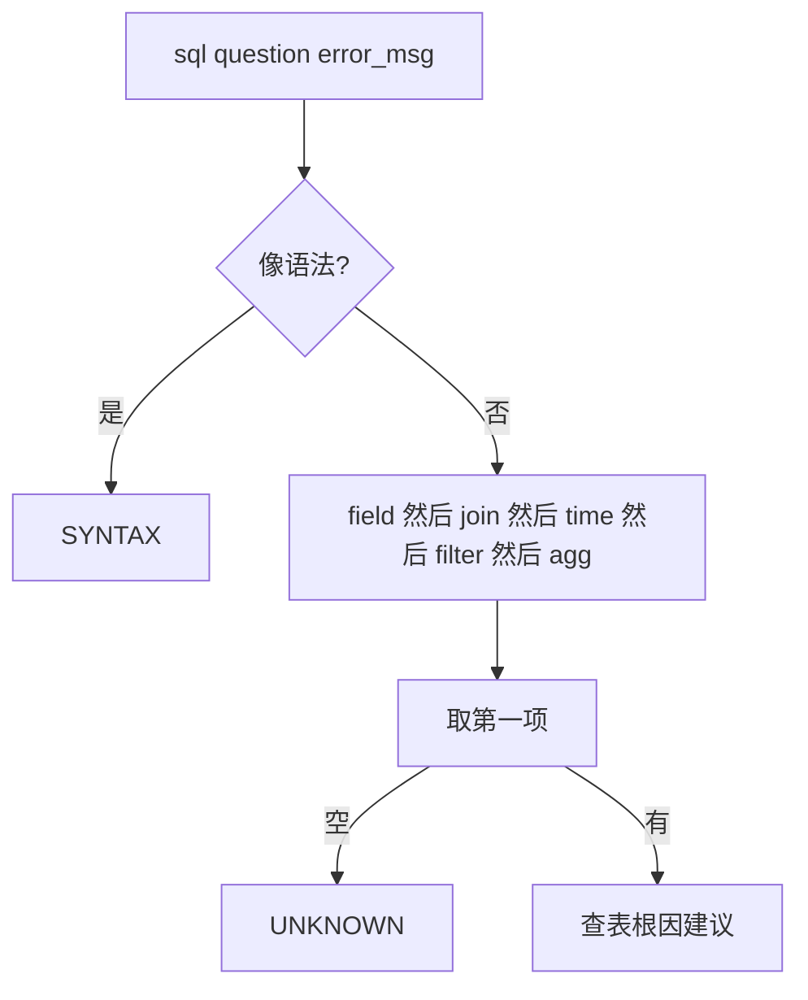

### schema_generator.py

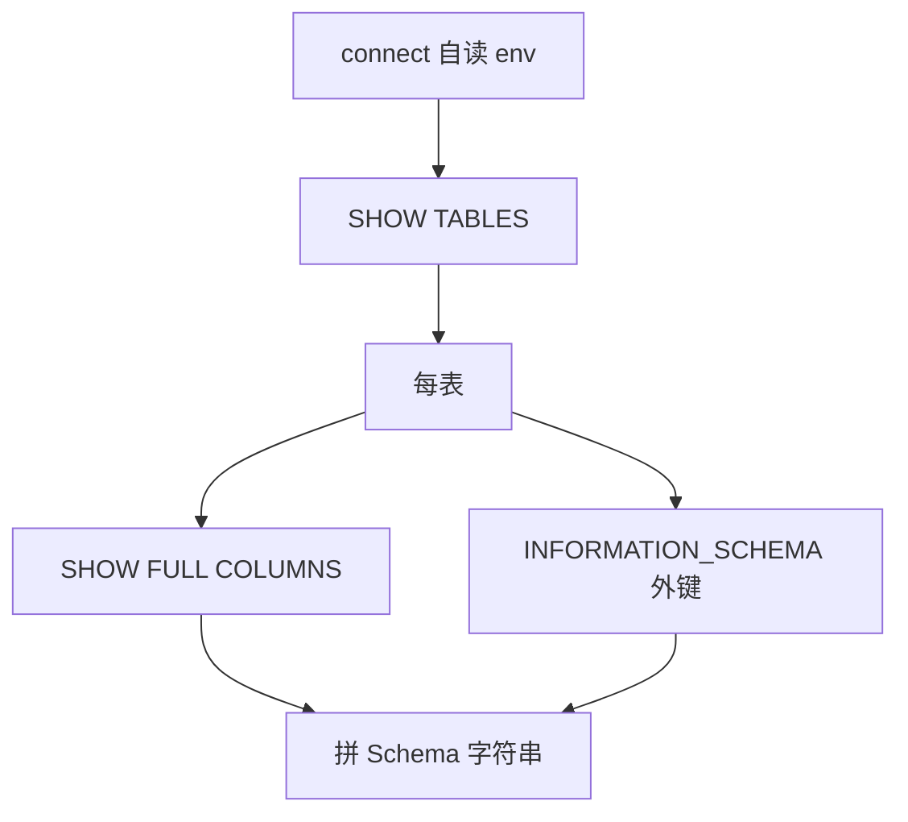

### text2sql v0 / v1 / v2

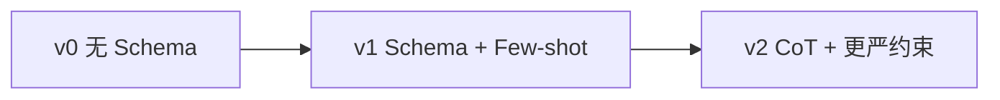

三版各自调 API、剥围栏、只打印 SQL，不走 `ChatBISystem`。
